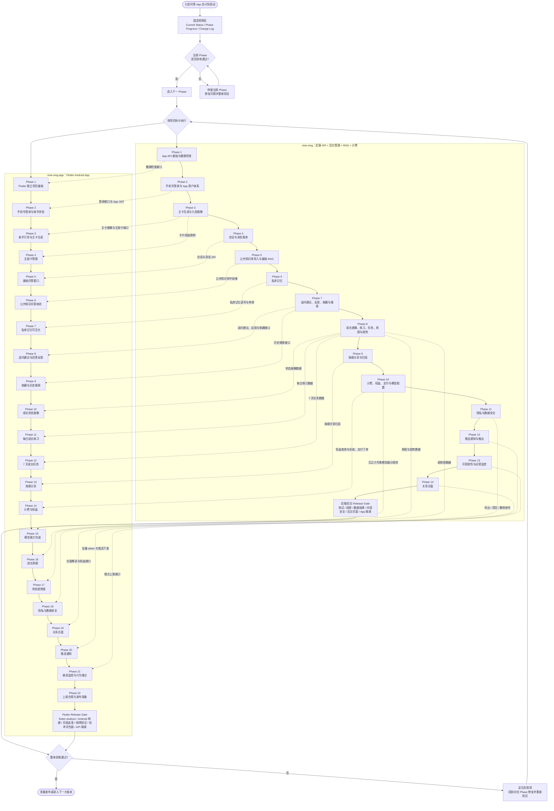

# 九型问答 App 总计划流程图

来源计划：
- 后端/后台计划：`/Users/wohenzaiyi/Desktop/nine-xing/docs/app-backend-admin-plan.md`
- Flutter App 计划：`/Users/wohenzaiyi/Desktop/nine-xing-app/docs/flutter-app-plan.md`

执行原则：
- 后端/后台放在当前 `nine-xing` 项目。
- Flutter App 放在独立 `nine-xing-app` 项目。
- 每个阶段必须完成本地验证、联调验证和用户验收后，才进入下一阶段。

